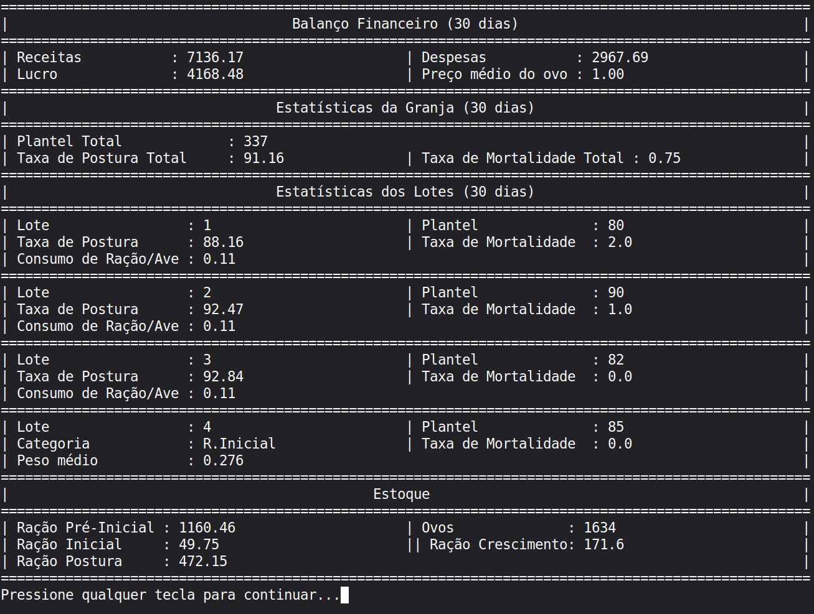

<div align="center">

# Poultry Analytics System

**Sistema de gerenciamento de granja de galinhas poedeiras caipiras**


</div>

---

## A história por trás do projeto

Cursei Veterinária e Análise e Desenvolvimento de Sistemas ao mesmo tempo. Nas aulas de avicultura aprendi que os indicadores que separam uma granja lucrativa de uma que perde dinheiro em silêncio são simples: taxa de postura, consumo de ração por ave, mortalidade semanal. O problema é que esses números precisam ser registrados e cruzados com frequência, e quase ninguém faz isso de forma estruturada em produções de pequeno porte.

Minha família vivenciava exatamente isso. Nossa pequena produção familiar de caipiras era controlada em cadernos, com anotações inconsistentes e sem nenhuma visão financeira integrada. Não era possível responder perguntas básicas como: qual lote está consumindo mais ração do que deveria? Estamos tendo lucro com os ovos esse mês? Quanto de ração ainda temos em estoque?

O Poultry Analytics System é a resposta prática para essas perguntas, construído com o conhecimento técnico das duas graduações.

---

## O que o sistema resolve

| Problema | Solução |
|---|---|
| Controle de lotes feito em cadernos | CRUD completo com banco relacional |
| Sem visibilidade financeira integrada | Dashboard de receitas, despesas e lucro |
| Estoque de rações desconhecido | Cálculo automático compra x consumo por tipo |
| Sem métricas de desempenho por lote | Taxa de postura, mortalidade e consumo/ave |
| Dados de produção e financeiro separados | Schema unificado com relacionamentos consistentes |

---

## Funcionalidades

**Dashboard da granja:**
Plantel total consolidado, taxa de postura média e taxa de mortalidade com janela dos últimos 30 dias.

**Gestão de lotes:**
Suporte ao ciclo de vida completo das aves. A fase de pré-produção registra diariamente peso, consumo de ração e água e mortalidade. A fase de produção registra ovos inteiros e defeituosos, mortalidade, consumo e taxa de postura. Cada lote tem seu próprio painel de métricas do período.

**Módulo financeiro:**
Registro de vendas de ovos e compras de insumos, com cálculo automático de receitas, despesas, lucro líquido e preço médio do ovo nos últimos 30 dias.

**Controle de estoque:**
Rastreamento em tempo real de quatro tipos de ração: Pré-Inicial, Inicial, Crescimento e Postura. O estoque é calculado como `total comprado - total consumido`, cruzando registros financeiros com dados de produção.

**Gestão de galpões:**
Cadastro de galpões com área e vínculo direto aos lotes alocados.

---



---

## Estrutura do banco de dados

```
+----------+       +------------------------------------------------+
| galpoes  |       |                    lotes                       |
+----------+       +------------------------------------------------+
| id (PK)  |<------| id (PK) | galpao (FK) | nascimento             |
| area     |       | inicio_producao | descarte | qtd_inicial       |
+----------+       | qtd_atual | fornecedor | racao (ENUM)          |
                   +--------------------+---------------------------+
                                        |
                    +-------------------+-------------------+
                    |                                       |
        +-----------+-----------+           +---------------+------------+
        |      preproducao      |           |           producao         |
        +-----------------------+           +----------------------------+
        | id | id_lote (FK)     |           | id | id_lote (FK)          |
        | dia | mortalidade     |           | dia | ovos_inteiros        |
        | consumo_racao         |           | ovos_defeituosos           |
        | consumo_agua | peso   |           | mortalidade                |
        | categoria (ENUM) | obs|           | consumo_racao | taxa | obs |
        +-----------------------+           +----------------------------+

        +-----------------------------------------------------------+
        |                        financeiro                         |
        +-----------------------------------------------------------+
        | id | dia | categoria (ENUM) | qtd | valor | forn_comp|obs |
        +-----------------------------------------------------------+
```

As categorias de ração usam `ENUM` porque refletem fases zootécnicas bem definidas da criação de caipiras. Isso garante consistência nos dados sem depender de validação na camada de aplicação.

---

## Tecnologias

- Python 3.10+
- MySQL 8.0 / MariaDB
- mysql-connector-python (driver oficial)
- python-dotenv (gerenciamento de variáveis de ambiente)

---

## Como executar

**Pré-requisitos:** Python 3.10+ e MySQL Server 8.0+ ou MariaDB

```bash
# Clone o repositório
git clone https://github.com/dmrodrigues-dev/poultry-analytics-system.git
cd poultry-analytics-system

# Instale as dependências
pip install -r requirements.txt

# Configure o banco de dados
mysql -u root -p < schema.sql

# Opcional: popule com dados de exemplo
mysql -u root -p granja < seed_granja.sql
```

Crie um arquivo `.env` na raiz do projeto com as suas credenciais:

```
DB_HOST=localhost
DB_USER=root
DB_PASSWORD=sua_senha
DB_NAME=granja
```

```bash
python main.py
```

---

## Estrutura do projeto

```
poultry-analytics-system/
│
├── main.py              # Ponto de entrada, interface CLI e lógica de negócio
├── crud.py              # Camada de acesso a dados (CRUD e queries analíticas)
├── analytics.py         # Camada de processamento e montagem de dados
├── schema.sql           # Definição do banco de dados
├── seed_granja.sql      # Dados de exemplo para desenvolvimento
├── requirements.txt     # Dependências Python
├── .env                 # Credenciais locais (não versionado)
├── .gitignore
└── docs/
    └── guia_manejo.md   # Guia de manejo da raça (referência técnica)
```

---

## Decisões técnicas

**Queries parametrizadas:** todas as queries usam `%s` com `cursor.execute()`, evitando SQL Injection mesmo sendo uma aplicação de uso interno.

**Estoque calculado dinamicamente:** ao invés de um campo `estoque` que pode sair de sincronia com os registros, o sistema calcula `comprado - consumido` em tempo real. Isso elimina uma classe inteira de bugs de inconsistência.

**ENUM para categorias de ração:** as fases de criação (Pré-Inicial, Inicial, Crescimento, Postura) são bem definidas pela zootecnia e não mudam. Modelar como ENUM em vez de uma tabela separada reflete essa realidade do domínio.

**Variáveis de ambiente:** as credenciais de banco de dados são carregadas via `.env` com `python-dotenv`, mantendo dados sensíveis fora do repositório.

**Arquitetura em camadas:** o projeto é dividido em três camadas com responsabilidades distintas. `crud.py` concentra todo o acesso ao banco de dados. `analytics.py` processa e monta os dados para exibição. `main.py` contém a interface, a lógica de negócio e orquestra as transações. Essa separação facilita manutenção e evolução do sistema — alterar uma query não impacta a interface, e vice-versa.

---

## Sobre o autor

Desenvolvido por alguém que estudou ao mesmo tempo como uma galinha cresce e como um banco de dados é normalizado, e que achou que fazia sentido juntar as duas coisas.